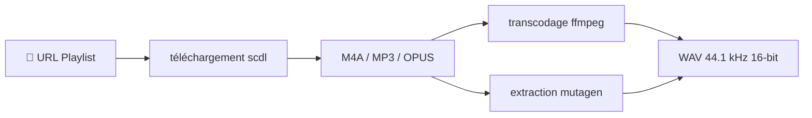

<div align="center">

[](https://github.com/Sofian-bll/scpdl-wav/blob/main/LICENSE)
[](https://github.com/Sofian-bll/scpdl-wav/releases)
[](https://github.com/Sofian-bll/scpdl-wav/stargazers)

<p align="center">
  
</p>

<a id="readme-top"></a>
<h1 align="center">Soundcloud WAV Playlist Downloader</h1>

<p align="center">Téléchargez des playlists SoundCloud et convertissez chaque piste en WAV lossless avec métadonnées préservées.</p>

<p align="center">🇬🇧 <a href="README.md">English</a> · 🇫🇷 <a href="README.fr.md"><b>Français</b></a></p>

</div>

---

## Fonctionnalités

- **Téléchargement complet de playlists** — pointez vers une URL de set SoundCloud, récupérez toutes les pistes en une exécution
- **Conversion WAV lossless** — ffmpeg transcode en WAV stéréo 44.1 kHz / 16-bit non compressé
- **Préservation des métadonnées** — titre, artiste, album, genre, numéro de piste, date et pochette conservés depuis la source
- **Multi-format en entrée** — gère les sources M4A (AAC), MP3 (ID3) et OPUS avec extraction adaptée à chaque format

## Technos utilisées

- [](https://www.python.org/) — langage principal
- [](https://github.com/flyingrub/scdl) — téléchargement SoundCloud
- [](https://ffmpeg.org/) — transcodage audio
- [](https://mutagen.readthedocs.io/) — extraction métadonnées

## Démarrage rapide

```bash
# Cloner et configurer
git clone https://github.com/Sofian-bll/scpdl-wav.git
cd scpdl-wav

# Créer l'environnement virtuel et installer les dépendances
python3 -m venv .venv && source .venv/bin/activate
pip install -r requirements.txt

# Installer ffmpeg (si pas déjà installé)
brew install ffmpeg        # macOS
# apt install ffmpeg        # Linux
```

## Utilisation

```bash
# Mode interactif — collez l'URL quand demandé
python scpdlwav.py

# Passer l'URL directement
python scpdlwav.py --url https://soundcloud.com/user/sets/playlist-name

# Dry-run (aperçu sans téléchargement)
python scpdlwav.py --dry-run --url https://soundcloud.com/user/sets/playlist-name

# Mode verbeux
python scpdlwav.py --verbose --url https://soundcloud.com/user/sets/playlist-name
```

Les pistes sont téléchargées dans `downloads/<nom-playlist>/` et les WAV dans `downloads/<nom-playlist>/WAV/`.

## Avertissement légal

Cet outil est destiné à un **usage personnel et éducatif uniquement**. Il
orchestre des composants open-source pour télécharger de la musique à laquelle
l'utilisateur a légalement accès via son compte SoundCloud. L'utilisateur est
seul responsable du respect des conditions d'utilisation de SoundCloud et des
lois sur le droit d'auteur en vigueur dans sa juridiction.

Ce projet n'héberge, ne distribue ni ne monétise aucun contenu protégé.

## Fonctionnement



1. **scdl** télécharge chaque piste du set SoundCloud
2. **ffmpeg** transcode chaque fichier en WAV PCM non compressé
3. **mutagen** extrait les métadonnées (tags, pochette) de la source et les injecte dans le WAV via ID3

## Structure du projet

```
scpdlwav.py          # Script principal — téléchargement, conversion, métadonnées
setup_env.py         # Script de configuration initiale
requirements.txt     # Dépendances Python
docs/                # Page d'accueil et assets
assets/              # Logo
```

## Démo

```bash
$ python scpdlwav.py --url https://soundcloud.com/artist/sets/mixtape

Soundcloud WAV Playlist Downloader
Dossier de téléchargement: downloads/mixtape
Dossier WAV: downloads/mixtape/WAV

[1/14] Téléchargement de la playlist...
[1/14] → Conversion: 'Track.m4a' → 'Track.wav'
[1/14] Métadonnées sauvegardées pour Track.wav
...
Conversion terminée: 14 réussies, 0 erreurs
```

## Contribuer

Les contributions sont les bienvenues.

1. Fork le projet
2. Créez votre branche (`git checkout -b feat/fonctionnalite-geniale`)
3. Committez vos changements (`git commit -m "feat: ajout fonctionnalité"`)
4. Poussez la branche (`git push origin feat/fonctionnalite-geniale`)
5. Ouvrez une Pull Request

## Licence

MIT © 2026 Sofian — voir [LICENSE](LICENSE).

<p align="right">(<a href="#readme-top">haut de page</a>)</p>

<!-- REFERENCE_LINKS -->
[python]: https://img.shields.io/badge/python-3670A0?style=flat&logo=python&logoColor=ffdd54
[ffmpeg]: https://img.shields.io/badge/ffmpeg-007808?style=flat&logo=ffmpeg&logoColor=white
[mutagen]: https://img.shields.io/badge/mutagen-888888?style=flat&logo=python&logoColor=white
[scdl]: https://img.shields.io/badge/scdl-ff5500?style=flat&logo=soundcloud&logoColor=white
