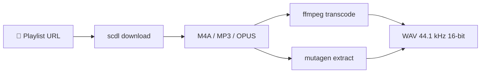

<div align="center">

[](https://github.com/Sofian-bll/scpdl-wav/blob/main/LICENSE)
[](https://github.com/Sofian-bll/scpdl-wav/releases)
[](https://github.com/Sofian-bll/scpdl-wav/stargazers)

<p align="center">
  
</p>

<a id="readme-top"></a>
<h1 align="center">Soundcloud WAV Playlist Downloader</h1>

<p align="center">Download SoundCloud playlists and convert every track to lossless WAV with preserved metadata.</p>

<p align="center">🇬🇧 <a href="README.md"><b>English</b></a> · 🇫🇷 <a href="README.fr.md">Français</a></p>

</div>

---

## Features

- **Full playlist downloads** — point at a SoundCloud set URL, get every track in one run
- **Lossless WAV conversion** — ffmpeg transcodes to uncompressed 44.1 kHz / 16-bit stereo WAV
- **Metadata preservation** — title, artist, album, genre, track number, date, and cover art carried over from source
- **Multi-format input** — handles M4A (AAC), MP3 (ID3), and OPUS with format-specific extraction

## Built With

- [](https://www.python.org/) — core runtime
- [](https://github.com/flyingrub/scdl) — SoundCloud downloader
- [](https://ffmpeg.org/) — audio transcoding
- [](https://mutagen.readthedocs.io/) — metadata extraction

## Quick Start

```bash
# Clone and set up
git clone https://github.com/Sofian-bll/scpdl-wav.git
cd scpdl-wav

# Create virtual environment and install dependencies
python3 -m venv .venv && source .venv/bin/activate
pip install -r requirements.txt

# Install ffmpeg (if not already installed)
brew install ffmpeg        # macOS
# apt install ffmpeg        # Linux
```

## Usage

```bash
# Interactive mode — paste the URL when prompted
python scpdlwav.py

# Pass URL directly
python scpdlwav.py --url https://soundcloud.com/user/sets/playlist-name

# Dry-run (preview without downloading)
python scpdlwav.py --dry-run --url https://soundcloud.com/user/sets/playlist-name

# Verbose logging
python scpdlwav.py --verbose --url https://soundcloud.com/user/sets/playlist-name
```

Tracks are downloaded to `downloads/<playlist-name>/` and WAV files land in `downloads/<playlist-name>/WAV/`.

## Disclaimer

This tool is intended for **personal and educational use only**. It orchestrates
open-source components to download music that users have legal access to via
their SoundCloud account. Users are solely responsible for complying with
SoundCloud's Terms of Service and applicable copyright laws in their
jurisdiction.

This project does not host, distribute, or monetize any copyrighted content.

## How It Works



1. **scdl** downloads every track from the SoundCloud set
2. **ffmpeg** transcodes each file to uncompressed PCM WAV
3. **mutagen** extracts metadata (tags, cover art) from the source and embeds it into the WAV via ID3

## Project Structure

```
scpdlwav.py          # Main script — download, convert, embed metadata
setup_env.py         # One-shot environment setup
requirements.txt     # Python dependencies
docs/                # Landing page and assets
assets/              # Logo
```

## Demo

```bash
$ python scpdlwav.py --url https://soundcloud.com/artist/sets/mixtape

Soundcloud WAV Playlist Downloader
Dossier de télépchargement: downloads/mixtape
Dossier WAV: downloads/mixtape/WAV

[1/14] Télépchargement de la playlist...
[1/14] → Conversion: 'Track.m4a' → 'Track.wav'
[1/14] Métadonnées sauvegardées pour Track.wav
...
Conversion terminée: 14 réussies, 0 erreurs
```

## Contributing

Contributions are welcome.

1. Fork the project
2. Create your feature branch (`git checkout -b feat/amazing-feature`)
3. Commit your changes (`git commit -m "feat: add amazing feature"`)
4. Push to the branch (`git push origin feat/amazing-feature`)
5. Open a Pull Request

## License

MIT © 2026 Sofian — see [LICENSE](LICENSE).

<p align="right">(<a href="#readme-top">back to top</a>)</p>

<!-- REFERENCE_LINKS -->
[python]: https://img.shields.io/badge/python-3670A0?style=flat&logo=python&logoColor=ffdd54
[ffmpeg]: https://img.shields.io/badge/ffmpeg-007808?style=flat&logo=ffmpeg&logoColor=white
[mutagen]: https://img.shields.io/badge/mutagen-888888?style=flat&logo=python&logoColor=white
[scdl]: https://img.shields.io/badge/scdl-ff5500?style=flat&logo=soundcloud&logoColor=white
